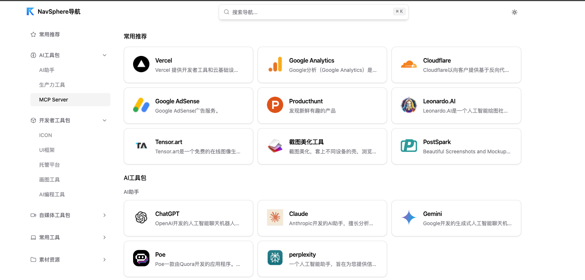
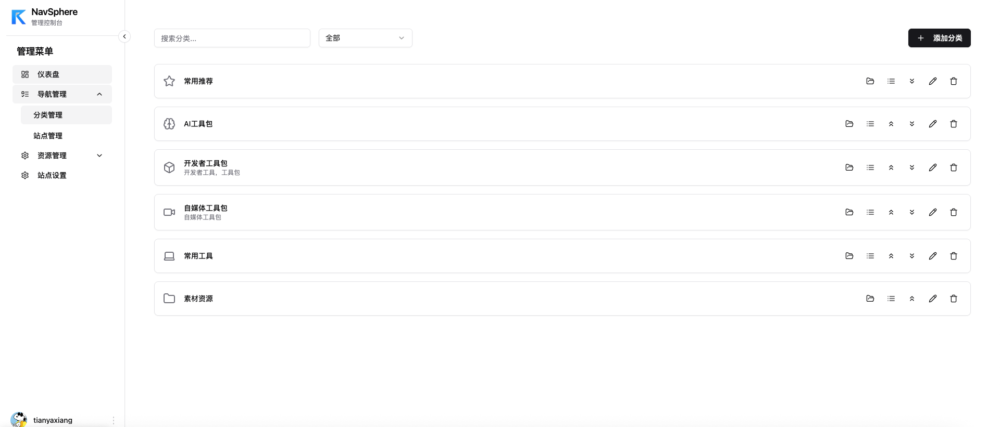

# NavSphere


<p align="center">
  <strong>现代化导航管理平台 | Modern Navigation Management Platform</strong>
</p>

<p align="center">
  <a href="https://github.com/tianyaxiang/NavSphere/stargazers"></a>
  <a href="https://github.com/tianyaxiang/NavSphere/network"></a>
  <a href="https://github.com/tianyaxiang/NavSphere/issues"></a>
  <a href="https://github.com/tianyaxiang/NavSphere/blob/main/LICENSE"></a>
</p>

<p align="center">
  <a href="https://vercel.com/new/clone?repository-url=https%3A%2F%2Fgithub.com%2Ftianyaxiang%2FNavSphere&env=GITHUB_ID,GITHUB_SECRET,GITHUB_OWNER,GITHUB_REPO,GITHUB_BRANCH,NEXTAUTH_URL,NEXT_PUBLIC_API_URL&envDescription=GitHub%20OAuth%20%E5%92%8C%E6%95%B0%E6%8D%AE%E4%BB%93%E5%BA%93%E9%85%8D%E7%BD%AE&envLink=https%3A%2F%2Fgithub.com%2Ftianyaxiang%2FNavSphere%23%E7%8E%AF%E5%A2%83%E5%8F%98%E9%87%8F%E8%AE%BE%E7%BD%AE&project-name=navsphere&repository-name=navsphere">
    
  </a>
</p>

## 📖 项目简介

NavSphere 是一个基于 Next.js 14 构建的现代化导航管理平台，专为个人和团队打造的书签管理和导航门户解决方案。通过 GitHub 作为数据存储后端，提供安全、可靠的导航数据管理体验。<a href="https://mp.weixin.qq.com/s/90LUmKilfLZfc5L63Ej3Sg" target="_blank">[手把手快速部署教程]</a>

<p align="center">
  
</p>
<p align="center">
  
</p>

## ✨ 核心特性

- 🚀 **现代技术栈**: Next.js 14 + React 18 + TypeScript + Tailwind CSS
- 🔐 **GitHub 认证**: 基于 NextAuth.js 的 GitHub OAuth 安全登录
- � **Git 数h据存储**: 使用 GitHub 仓库作为数据后端，版本可控
- � **响应式设 计**: 移动优先的设计理念，完美适配各种设备
- 🌓 **主题切换**: 内置深色/浅色主题支持
- 🎯 **拖拽排序**: 直观的拖拽界面，轻松管理导航项目
- 🔍 **智能搜索**: 快速定位和访问导航项目
- 📱 **PWA 支持**: 渐进式 Web 应用体验
- 🌐 **多语言支持**: 中英文界面切换
- ⚡ **边缘计算**: Cloudflare Pages 部署，全球加速

## 🛠️ 技术架构

| 技术栈              | 版本          | 用途                  |
| ------------------- | ------------- | --------------------- |
| **Next.js**         | 14.0.4        | React 全栈框架        |
| **React**           | 18.2.0        | 用户界面库            |
| **TypeScript**      | 5.1.6         | 类型安全的 JavaScript |
| **Tailwind CSS**    | 3.3.3         | 原子化 CSS 框架       |
| **NextAuth.js**     | 5.0.0-beta.25 | 身份认证解决方案      |
| **Radix UI**        | Latest        | 无障碍 UI 组件库      |
| **Lucide React**    | 0.462.0       | 现代图标库            |
| **React Query**     | 5.61.5        | 数据获取和状态管理    |
| **React Hook Form** | 7.53.2        | 表单处理              |
| **Zod**             | 3.22.4        | 数据验证              |

## 🚀 快速开始

### 一键部署

[](https://vercel.com/new/clone?repository-url=https%3A%2F%2Fgithub.com%2Ftianyaxiang%2FNavSphere&env=GITHUB_ID,GITHUB_SECRET,GITHUB_OWNER,GITHUB_REPO,GITHUB_BRANCH,NEXTAUTH_URL,NEXT_PUBLIC_API_URL&envDescription=GitHub%20OAuth%20%E5%92%8C%E6%95%B0%E6%8D%AE%E4%BB%93%E5%BA%93%E9%85%8D%E7%BD%AE&envLink=https%3A%2F%2Fgithub.com%2Ftianyaxiang%2FNavSphere%23%E7%8E%AF%E5%A2%83%E5%8F%98%E9%87%8F%E8%AE%BE%E7%BD%AE&project-name=navsphere&repository-name=navsphere)

点击上方按钮即可一键部署到 Vercel，部署完成后需要配置环境变量。

### 环境要求

- Node.js 18.0+ 
- pnpm 8.0+ (推荐) 或 npm/yarn
- GitHub 账户

### 安装步骤

1. **克隆项目**
```bash
git clone https://github.com/tianyaxiang/NavSphere.git
cd NavSphere
```

2. **安装依赖**
```bash
pnpm install
```

3. **配置环境变量**
```bash
cp .env.example .env.local
```

4. **启动开发服务器**
```bash
pnpm dev
```

5. **访问应用**
   
   打开浏览器访问 [http://localhost:3000](http://localhost:3000)

## ⚙️ 配置指南

### 环境变量设置

创建 `.env.local` 文件并配置以下变量：

```env
# GitHub OAuth App 配置
GITHUB_ID=your-github-client-id
GITHUB_SECRET=your-github-client-secret

# GitHub 仓库配置  
GITHUB_OWNER=your-github-username
GITHUB_REPO=your-repo-name
GITHUB_BRANCH=main

# NextAuth 配置
NEXTAUTH_URL=http://localhost:3000/api/auth
NEXT_PUBLIC_API_URL=http://localhost:3000
```

### GitHub OAuth App 设置

1. **创建 OAuth App**
   - 访问 [GitHub Developer Settings](https://github.com/settings/developers)
   - 点击 "New OAuth App"
   - 填写应用信息：
     ```
     Application name: NavSphere
     Homepage URL: http://localhost:3000
     Authorization callback URL: http://localhost:3000/api/auth/callback/github
     ```

2. **获取凭据**
   - Client ID: 应用详情页显示
   - Client Secret: 点击 "Generate a new client secret" 生成

### GitHub 数据仓库设置

1. **创建数据仓库**
   - 访问 [GitHub New Repository](https://github.com/new)
   - 仓库名建议: `navsphere-data`
   - 可选择 Public 或 Private

2. **初始化数据文件**
   
   项目会自动创建以下数据文件：
   - `navigation.json` - 导航数据
   - `site.json` - 站点配置
   - `resources.json` - 资源数据

### 部署前准备清单

在使用一键部署功能前，请确保完成以下准备工作：

- [ ] 创建 GitHub OAuth App 并获取 Client ID 和 Secret
- [ ] 创建用于存储数据的 GitHub 仓库
- [ ] 记录你的 GitHub 用户名和数据仓库名称
- [ ] 准备好你的 Vercel 项目域名（用于配置 NEXTAUTH_URL 和 NEXT_PUBLIC_API_URL）

## 🚀 部署指南

### Vercel 部署 (推荐)

#### 方式一：一键部署

1. **点击部署按钮**
   
   [](https://vercel.com/new/clone?repository-url=https%3A%2F%2Fgithub.com%2Ftianyaxiang%2FNavSphere&env=GITHUB_ID,GITHUB_SECRET,GITHUB_OWNER,GITHUB_REPO,GITHUB_BRANCH,NEXTAUTH_URL,NEXT_PUBLIC_API_URL&envDescription=GitHub%20OAuth%20%E5%92%8C%E6%95%B0%E6%8D%AE%E4%BB%93%E5%BA%93%E9%85%8D%E7%BD%AE&envLink=https%3A%2F%2Fgithub.com%2Ftianyaxiang%2FNavSphere%23%E7%8E%AF%E5%A2%83%E5%8F%98%E9%87%8F%E8%AE%BE%E7%BD%AE&project-name=navsphere&repository-name=navsphere)

2. **配置环境变量**
   
   在部署过程中，Vercel 会要求你配置以下环境变量：
   ```env
   GITHUB_ID=your-github-client-id
   GITHUB_SECRET=your-github-client-secret
   GITHUB_OWNER=your-github-username
   GITHUB_REPO=your-data-repo-name
   GITHUB_BRANCH=main
   NEXTAUTH_URL=https://your-project-name.vercel.app/api/auth
   NEXT_PUBLIC_API_URL=https://your-project-name.vercel.app
   ```

3. **更新 OAuth 回调地址**
   
   部署完成后，需要在 GitHub OAuth App 设置中更新回调地址：
   ```
   https://your-project-name.vercel.app/api/auth/callback/github
   ```

#### 方式二：手动部署

1. **Fork 项目到你的 GitHub**

2. **连接 Vercel**
   - 访问 [Vercel Dashboard](https://vercel.com/dashboard)
   - 点击 "New Project"
   - 选择你 Fork 的仓库

3. **配置环境变量**
   
   在 Vercel 项目设置中添加环境变量（同上）

4. **部署**
   
   Vercel 会自动检测 Next.js 项目并进行部署

### Cloudflare Pages 部署

1. **创建项目**
   - 登录 [Cloudflare Pages](https://pages.cloudflare.com/)
   - 连接 GitHub 仓库

2. **构建设置**
   
   在 Cloudflare Pages 项目设置中配置：
   ```bash
   # 构建命令
   npx @cloudflare/next-on-pages@1
   
   # 输出目录
   .vercel/output/static
   
   # Node.js 版本
   18.17.0
   ```

3. **环境变量配置**
   
   在 Cloudflare Pages 环境变量中添加：
   ```env
   GITHUB_ID=your-github-client-id
   GITHUB_SECRET=your-github-client-secret
   GITHUB_OWNER=your-github-username
   GITHUB_REPO=your-repo-name
   GITHUB_BRANCH=main
   NEXTAUTH_URL=https://your-domain.pages.dev/api/auth
   NEXT_PUBLIC_API_URL=https://your-domain.pages.dev
   ```

4. **兼容性设置**
   
   项目已包含 `wrangler.toml` 配置文件，确保 Cloudflare Pages 兼容性。

### Docker 部署

项目支持 Docker 容器化部署，适合自托管环境。

#### 快速部署

1. **克隆项目**
```bash
git clone https://github.com/tianyaxiang/NavSphere.git
cd NavSphere
```

2. **配置环境变量**
```bash
cp .env.example .env.local
# 编辑 .env.local 文件，配置必要的环境变量
```

#### 手动部署

1. **构建镜像**
```bash
docker build -f docker/Dockerfile -t navsphere:latest .
```

2. **使用 Docker Compose**
```bash
# 开发环境
docker-compose -f docker/docker-compose.yml up -d

# 生产环境
docker-compose -f docker/docker-compose.prod.yml up -d
```

3. **检查服务状态**
```bash
# 查看容器状态
docker-compose -f docker/docker-compose.yml ps

# 查看日志
docker-compose -f docker/docker-compose.yml logs -f

# 停止服务
docker-compose -f docker/docker-compose.yml down
```

#### Docker 配置说明

- **端口映射**: 容器内部端口 3000 映射到主机端口 3000
- **环境变量**: 通过 `.env.local` 文件注入
- **健康检查**: 内置健康检查端点 `/api/health`
- **自动重启**: 容器异常退出时自动重启

### 其他部署平台

- **Netlify**: 需要配置构建命令  
- **Railway**: 支持 Docker 部署
- **自托管**: 支持 Docker 容器部署

## 📊 数据结构

### 数据文件说明

项目使用 GitHub 仓库存储数据，自动创建以下文件：

| 文件              | 用途     | 位置           |
| ----------------- | -------- | -------------- |
| `navigation.json` | 导航数据 | 数据仓库根目录 |
| `site.json`       | 站点配置 | 数据仓库根目录 |
| `resources.json`  | 资源数据 | 数据仓库根目录 |

### 数据格式示例

<details>
<summary><strong>navigation.json</strong> - 导航数据结构</summary>

```json
[
  {
    "id": "dev-tools",
    "title": "开发工具",
    "icon": "🛠️",
    "items": [
      {
        "title": "GitHub",
        "titleEn": "GitHub", 
        "description": "代码托管平台",
        "descriptionEn": "Code hosting platform",
        "icon": "https://github.com/favicon.ico",
        "href": "https://github.com"
      }
    ],
    "subCategories": [
      {
        "id": "frontend",
        "title": "前端工具",
        "items": []
      }
    ]
  }
]
```
</details>

<details>
<summary><strong>site.json</strong> - 站点配置结构</summary>

```json
{
  "basic": {
    "title": "NavSphere",
    "description": "现代化导航管理平台",
    "keywords": "导航,书签,管理"
  },
  "appearance": {
    "logo": "/logo.png",
    "favicon": "/favicon.ico", 
    "theme": "system"
  }
}
```
</details>

## 🔧 开发指南

### 可用脚本

```bash
# 开发模式
pnpm dev

# 构建项目
pnpm build

# 启动生产服务器
pnpm start

# 代码检查
pnpm lint

# 清理构建文件
pnpm clean
```

### 项目结构

```
NavSphere/
├── app/                    # Next.js App Router
│   ├── api/               # API 路由
│   ├── components/        # 页面组件
│   ├── globals.css        # 全局样式
│   └── layout.tsx         # 根布局
├── components/            # 共享组件
├── lib/                   # 工具函数
├── public/               # 静态资源
├── styles/               # 样式文件
└── types/                # TypeScript 类型定义
```

## 🐛 故障排除

### 常见问题

<details>
<summary><strong>认证失败</strong></summary>

**问题**: GitHub OAuth 登录失败

**解决方案**:
1. 检查 `GITHUB_ID` 和 `GITHUB_SECRET` 是否正确
2. 确认回调 URL 配置正确
3. 检查 OAuth App 权限设置
</details>

<details>
<summary><strong>数据加载失败</strong></summary>

**问题**: 导航数据无法加载

**解决方案**:
1. 验证 GitHub 仓库配置
2. 检查仓库访问权限
3. 确认数据文件格式正确
4. 查看浏览器控制台错误信息
</details>

<details>
<summary><strong>构建失败</strong></summary>

**问题**: 项目构建或部署失败

**解决方案**:
1. 检查 Node.js 版本 (需要 18.0+)
2. 清理依赖: `rm -rf node_modules pnpm-lock.yaml && pnpm install`
3. 检查环境变量配置
4. 查看构建日志详细错误信息
</details>

<details>
<summary><strong>Vercel 部署问题</strong></summary>

**问题**: Vercel 部署失败或运行异常

**解决方案**:
1. **环境变量检查**: 确保所有必需的环境变量都已正确配置
2. **NEXTAUTH_URL 设置**: 确保设置为你的 Vercel 域名 (如: `https://your-app.vercel.app`)
3. **GitHub OAuth 回调**: 更新 GitHub OAuth App 的回调地址为 Vercel 域名
4. **函数超时**: 如果 API 调用超时，检查 `vercel.json` 中的 `maxDuration` 设置
5. **查看日志**: 在 Vercel Dashboard 中查看函数日志和构建日志
</details>

<details>
<summary><strong>Cloudflare Pages 部署问题</strong></summary>

**问题**: Cloudflare Pages 部署失败或运行异常

**解决方案**:
1. **构建命令检查**: 确保使用 `npx @cloudflare/next-on-pages@1` 作为构建命令
2. **输出目录设置**: 确保输出目录设置为 `.vercel/output/static`
3. **Node.js 版本**: 确保使用 Node.js 18.17.0 或更高版本
4. **环境变量配置**: 检查所有环境变量是否正确配置
5. **兼容性标志**: 确保 `wrangler.toml` 文件包含正确的兼容性设置
6. **查看构建日志**: 在 Cloudflare Pages Dashboard 中查看详细的构建和部署日志
</details>


## 💖 支持我们

如果这个项目对你有帮助，欢迎支持我们的开发工作！

<p align="center">
  
</p>

<p align="center">
  <strong>扫码支持 | 您的支持是我们持续开发的动力</strong>
</p>

## 🤝 贡献指南

我们欢迎所有形式的贡献！

### 贡献方式

1. **报告问题**: 在 [Issues](https://github.com/tianyaxiang/NavSphere/issues) 中报告 bug
2. **功能建议**: 提出新功能想法
3. **代码贡献**: 提交 Pull Request
4. **文档改进**: 完善项目文档

### 开发流程

1. Fork 项目
2. 创建功能分支: `git checkout -b feature/amazing-feature`
3. 提交更改: `git commit -m 'Add amazing feature'`
4. 推送分支: `git push origin feature/amazing-feature`
5. 创建 Pull Request

## 📄 许可证

本项目基于 [MIT License](LICENSE) 开源协议。

## 🙏 致谢

- [Next.js](https://nextjs.org/) - 强大的 React 框架
- [Tailwind CSS](https://tailwindcss.com/) - 优秀的 CSS 框架
- [Radix UI](https://www.radix-ui.com/) - 无障碍组件库
- [Cloudflare Pages](https://pages.cloudflare.com/) - 可靠的部署平台
- 所有为项目做出贡献的开发者


---

<p align="center">
  <strong>⭐ 如果这个项目对你有帮助，请给我们一个 Star！</strong>
</p>
